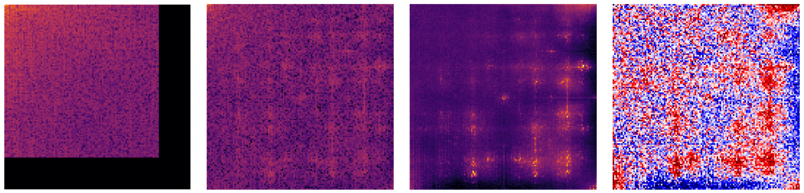
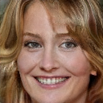
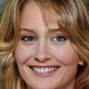
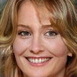
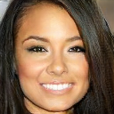
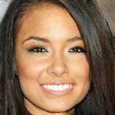
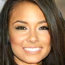
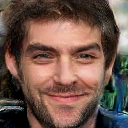
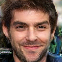
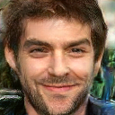

# Misleading Deep-Fake Detection with GAN Fingerprints



Code accompanying the 2022 DLS paper **_[Misleading Deep-Fake Detection with GAN Fingerprints](https://arxiv.org/abs/2205.12543)_**.
>Generative adversarial networks (GANs) have made
remarkable progress in synthesizing realistic-looking images that
effectively outsmart even humans. Although several detection
methods can recognize these deep fakes by checking for image
artifacts from the generation process, multiple counterattacks
have demonstrated their limitations. These attacks, however, still
require certain conditions to hold, such as interacting with the
detection method or adjusting the GAN directly. In this paper, we
introduce a novel class of simple counterattacks that overcomes
these limitations. In particular, we show that an adversary can
remove indicative artifacts, the GAN fingerprint, directly from the
frequency spectrum of a generated image. We explore different
realizations of this removal, ranging from filtering high frequencies
to more nuanced frequency-peak cleansing. We evaluate the
performance of our attack with different detection methods, GAN
architectures, and datasets. Our results show that an adversary
can often remove GAN fingerprints and thus evade the detection
of generated images.

## Preparation
We include a `requirements.txt` containing all dependencies. 
To install, run `python -m pip install -r requirements.txt`
### Datasets 
We used four GAN instances (ProGAN, SNGAN, MMDGAN and CramerGAN) to generate images. The instances are trained by 
Yu et al. [[1]](#1) and can be downloaded from [their GitHub page](https://github.com/ningyu1991/GANFingerprints).

In addition we used the datasets of real images that the GAN instances were trained on, 
the [CelebA](http://mmlab.ie.cuhk.edu.hk/projects/CelebA.html) and the [LSUN bedrooms](https://github.com/fyu/lsun)
datasets. 
#### Preprocessing
To crop the images to the required size of _(128x128x3)_, we used the scripts provided by Frank et al [[2]](#2). 
We slightly adapted the cropping script for LSUN to guarantee that the cropping results in squares and include the adaption in this repo.
They can be run with `python3 src/data-preparation/crop_lsun.py images/lsun_raw images/lsun_cropped` 
or `python3 src/data-preparation/crop_celeba.py images/celeba_raw images/celeba_cropped`

### Classifiers
We evaluated our attack on two classifiers by Frank et al. [[2]](#2), one pre-trained, as found on their 
[Google Drive](https://drive.google.com/drive/folders/1_KxKA4b2IaEhsovJeazoizw_eSkJH6IN), and additionally a binary Ridge
regression for each GAN instance, trained on 150'000 real and 150'000 GAN-generated images.
We also evaluated the attack on a binary classifier by Joslin and Hao [[3]](#3), which classifies images based on their cosine
similarity to a fingerprint. We train classifiers using their method
on 1000 real and 1000 GAN-generated images.
The model by Joslin et al. consists of a fingerprint and a threshold, which determines the largest difference to the fingerprint
an image of the class can have. We provide exemplary thresholds in `src/resources/threshold_joslin.json`

## Counterattacks
In this section, we describe how to execute the four attacks from the paper on a directory of images. 
### Fingerprint calculations
To run the targeted fingerprint removal attacks, the fingerprint of each GAN instance needs to be precalculated on a separate set of images.
To calculate the fingerprints run the script `src/counterattacks/fingerprint_calculation.py` with one of three options:  
`{mean|peak|regression}`. By default, the fingerprint will be saved in the current working directory, 
if not otherwise specified.

Example on how to precalculate the "Peaks"-fingerprint:
```
usage: fingerprint_calculation.py peak [-h] [--grayscale]
                                       [--threshold THRESHOLD]
                                       [--output OUTPUT]
                                       GAN_IMAGES REAL_DATASET

positional arguments:
  GAN_IMAGES            Path to GAN image dataset
  REAL_DATASET          Path to dataset of real images

optional arguments:
  -h, --help            show this help message and exit
  --grayscale, -g       Calculate on grayscaled images.
  --threshold THRESHOLD, -t THRESHOLD
                        Apply threshold within [0,1].
  --output OUTPUT, -o OUTPUT
                        Output folder.
```
For example `python fingerprint_calculation.py peak lsun/progan/images/train lsun/lsun/images/train -t 0.3 -o lsun/progan/fingerprint/`

REAL_DATASET is a collection of images from the dataset underlying the GAN instance, either LSUN or CelebA.
Optionally, a threshold within [0,1] can be applied to the calculated fingerprint, setting every value below it to 0. 
Alternatively, the threshold can be applied during the image manipulation as described in the next section.
We precalculated the fingerprint on 5000 images each of the GAN instance and of the real image dataset.

To precalculate the fingerprint of the regression-weights attack, we first train a binary Lasso regression on 5000 
GAN-generated and real images each. The regression can be trained with the script `src/counterattacks/regression.py` 
that builds upon the included library by Frank et al. In the `lib/GANDCTAnalysis/prepare_dataset.py` script that is used in the process,
the constants determining the size of the used dataset must be manually set to the size of each class and in 
`lib/GANDCTAnalysis/classifier.py` to the size of the whole dataset.
e.g. 
```
    python lib/GANDCTAnalysis/prepare_dataset.py $HOME_PATH/regression -lnc tfrecords
    python src/counterattacks/regression.py --output lsun_progan log1 $HOME_PATH/regression_color_dct_log_scaled_normalized_train_tf/data.tfrecords $HOME_PATH/regression_color_dct_log_scaled_normalized_val_tf/data.tfrecords $HOME_PATH/regression_color_dct_log_scaled_normalized_test_tf/data.tfrecords
```
where `$HOME_PATH/regression` contains two folders, one with real and one with GAN-generated images. As described by 
[Frank et al.](lib/GANDCTAnalysis/README.md), the folder containing the real images needs to be first alphabetically.
The optional input arguments given by the `regression.py` script can largely be ignored, as they are needed for compatibility with
the code by Frank et al. 
The weights can then be extracted via the `src/counterattacks/fingerprint_calculation.py`script,
e.g. `fingerprint_calculation.py regression lsun_progan/log1 -o lsun/progan/fingerprint/`
### Executing the attacks
All four attacks can be executed using the `src/counterattack/fingerprint_roval.py` script. For the targeted fingerprint 
modes `{mean|peak|regression}` the script is applied as follows
```
usage: fingerprint_removal.py mean [-h] [--output OUTPUT] [--factor FACTOR]
                                   GAN_IMAGES FINGERPRINT

positional arguments:
  GAN_IMAGES            Folder of GAN image dataset to be manipulated.
  FINGERPRINT           .npy file which contains the precalculated fingerprint

optional arguments:
  -h, --help            show this help message and exit
  --output OUTPUT, -o OUTPUT
                        Output folder.
  --factor FACTOR       Factor by which to scale the fingerprint before
                        removal
```
where `factor` scales the fingerprint to raise/lower the impact of the attack.

#### Thresholds
When executing `fingerprint_removal.py peak` an additional argument `--threshold THRESHOLD` can be supplied. This threshold
will be applied to the fingerprint before removing it from the image. We determined the optimal thresholds at an image quality of 50dB
on the regression from the regression-weights attack. They are:

| **GAN architecture** | **LSUN** | **CelebA** |
|----------------------|---------:|-----------:|
| ProGAN               |      0.7 |       0.65 |
| SNGAN                |     0.35 |        0.4 |
| CramerGAN            |     0.15 |        0.2 |
| MMDGAN               |     0.15 |       0.25 |

#### Frequency bars
The mode `{bar}` is used for the untargeted frequency bars attack. Instead of a factor, the `width` of the bar to remove
is an optional argument. 
```
usage: fingerprint_removal.py bar [-h] [--width WIDTH] [--output OUTPUT]
                                  GAN_IMAGES

positional arguments:
  GAN_IMAGES            Folder of GAN image dataset to be manipulated.

optional arguments:
  -h, --help            show this help message and exit
  --width WIDTH         Width of bar to remove. Default is 10.
  --output OUTPUT, -o OUTPUT
                        Output folder.
```

## Additional
### Examples
We show examples of manipulated images and the impact an attack with such a strength that image quality drops to 30dB has.
Note that for the Bars attack, a much smaller attack strength then shown here already leads to a high success rate.

|           |                 Original                 |                 Mean                 |                 Peaks                 |                 Regression                 |                 Bars                 |
|-----------|:----------------------------------------:|:------------------------------------:|:-------------------------------------:|:------------------------------------------:|:------------------------------------:|
| ProGAN    |     |     |     |     |     |
| SNGAN     |      |      |      |      |      |
| CramerGAN |  |  |  |  |  |
| MMDGAN    |     |     |     |     |     |

### LRP Explanations
To get a better understanding of the classifiers, we applied LRP to retrieve explanations. We use the 
[_innvestigate_ library](https://github.com/albermax/innvestigate).
As our models are in tf 2, we use the [upates_towards_tf2.0 branch](https://github.com/albermax/innvestigate/tree/updates_towards_tf2.0), as included in `lib/innvestigate`.
To calculate the mean explanations as shown in the paper, use the script `src/evaluation/lrp_explanations`:
```
usage: lrp_explanations.py multi [-h] [--method METHOD] [--number NUMBER]
                                 [--output OUTPUT]
                                 GAN MODE CLASSIFIER DATASET GAN_STATS

positional arguments:
  GAN              Number which indicates the correct GAN class.
  MODE             Model type {multi, binary}
  CLASSIFIER       Path to classifier
  DATASET          Directory of images as input to model.
  GAN_STATS        Directory to mean and var of IMAGES, to use for conversion
                   to DCT.

optional arguments:
  -h, --help       show this help message and exit
  --method METHOD  Analysis method to use. Default is 'lrp.z'
  --number NUMBER  Number of images to analyze.
  --output OUTPUT  Output file.
```
`method` takes all methods the innvestigate library is capable of, the default method is `lrp.z`. 
The one used in the paper on the multi-class classifier
by Frank et al. is `lrp.sequential_preset_a_flat`, a composite rule for CNNs. 

### Citation
``` 
@inproceedings{,
    author = {Wesselkamp,Vera and Rieck, Konrad and Arp, Daniel and Quiring, Erwin},
    title = {Misleading Deep-Fake Detection with GAN Fingerprints},
    booktitle = {Deep Learning and Security Workshop ({DLS})},
    year = {2022}
}
```
## References
<a id="1">[1]</a> N. Yu, L. S. Davis, and M. Fritz. Attributing fake images to GANs:
Learning and analyzing GAN fingerprints. In Proc. of the IEEE/CVF
International Conference on Computer Vision (ICCV), 2019.

<a id="2">[2]</a> J. Frank, T. Eisenhofer, L. Schönherr, A. Fischer, D. Kolossa, and T. Holz.
Leveraging frequency analysis for deep fake image recognition. In Proc.
of Int. Conference on Machine Learning (ICML), 2020.

<a id="3">[3]</a> M. Joslin and S. Hao. Attributing and detecting fake images generated
by known GANs. In Deep Learning and Security Workshop (DLS), 2020.
